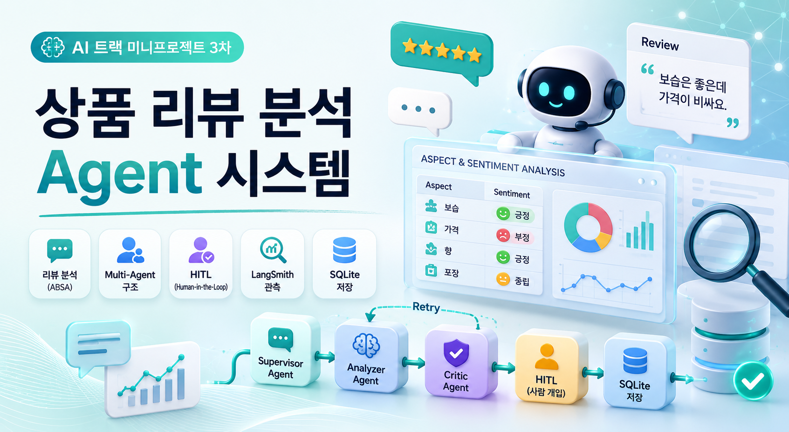

# 🧠 상품 리뷰 분석 Multi-Agent 시스템

상품 리뷰 데이터를 기반으로 속성(Aspect) 및 감성(Label)을 자동 분석하고,

- Critic 기반 검증
- Supervisor 정책 제어
- Retry 정책
- HITL(Human-In-The-Loop)
- LangSmith 기반 실행 추적

기능까지 포함한 LLMOps 기반 상품 리뷰 분석 Multi-Agent 시스템 프로젝트입니다.

---

# 📌 Project Overview

온라인 쇼핑 환경에서는 대량의 상품 리뷰가 지속적으로 생성되지만,

기업이 이를 직접 분석하기에는:

- 많은 시간 소요
- 운영 비용 증가
- 분석 품질 편차
- 단순 감성 분석 한계

등의 문제가 존재합니다.

특히 화장품 리뷰는:

- 보습
- 가격
- 향
- 포장

등 속성별 감정이 서로 다르게 표현되는 경우가 많아, 단순 긍/부정 분류만으로는 실제 VOC 분석에 한계가 존재했습니다.

본 프로젝트에서는 이러한 문제를 해결하기 위해:

- Aspect 기반 감성 분석(ABSA)
- Multi-Agent 구조
- Critic 기반 검증
- Retry 정책
- HITL
- Observability

를 포함한 실무형 AI 리뷰 분석 시스템을 설계했습니다.

---

# 🎯 Project Goals

- 상품 리뷰 속성(Aspect) 자동 추출
- 속성별 감성(Label) 분석
- Supervisor 기반 Multi-Agent 구조 설계
- Critic 기반 결과 검증
- Retry 정책 기반 재분석 흐름 구현
- HITL(Human-In-The-Loop) 기능 구현
- LangSmith 기반 실행 Trace 및 운영 관측 구축
- Streamlit 기반 리뷰 분석 Dashboard 구현

---

# ⚙️ Tech Stack

## AI / LLM
- OpenAI GPT-4.1-mini
- LangChain
- LangGraph
- LangSmith

## Backend
- Python
- SQLite

## Frontend
- Streamlit

## NLP
- ABSA (Aspect-Based Sentiment Analysis)

## LLMOps
- Retry Policy
- HITL
- Observability
- Trace Monitoring

---

# 🧩 System Workflow

```text
User Review Input
        ↓
Supervisor Agent
        ↓
Review Analyzer Agent
(Aspect Extraction + Sentiment Analysis)
        ↓
Critic Agent
(Result Validation)
        ↓
Retry / HITL Decision
        ↓
SQLite Storage
        ↓
Dashboard Visualization
```

단순 감성 분석이 아닌:

- 검증
- 재시도
- 사람 개입
- 운영 관측

까지 고려한 실무형 Multi-Agent 구조를 설계했습니다.

---

# 🧠 Multi-Agent Architecture

## 1. Supervisor Agent
- Workflow 흐름 제어
- Retry 여부 판단
- HITL 여부 판단
- 다음 실행 Agent 결정

## 2. Review Analyzer Agent
- Aspect 추출
- 감성(Label) 분석
- Evidence 생성

## 3. Critic Agent
- 결과 검증
- JSON 형식 검사
- 품질 평가
- 오류 유형(reason_code) 생성

---

# 🔄 State-based Workflow

LangGraph 기반 상태(State) 구조를 활용하여:

- analyzer_result
- critic_result
- retry_count
- reason_code
- next_agent
- human_feedback

등을 관리했습니다.

이를 통해:

- 조건 분기
- 재시도 흐름
- Agent 간 데이터 전달
- 상태 추적

이 가능하도록 설계했습니다.

---

# 🧪 ABSA Review Analysis

리뷰 문장에서:

- 보습
- 가격
- 향
- 포장

속성을 추출하고, 각 속성별 감성을 분석했습니다.

## Example

```json
{
  "aspect": "가격",
  "label": 0,
  "evidence": "가격이 조금 비쌈"
}
```

---

# 🔍 Technical Challenges

## Why Multi-Agent Architecture?

초기에는 단일 Agent 구조를 고려했지만, LLM 출력의 비결정성 문제로 인해:

- JSON 형식 오류
- 잘못된 Aspect 추출
- 감성 분석 오류
- 근거 부족

등이 발생했습니다.

이를 해결하기 위해:

- Analyzer
- Critic
- Supervisor

역할을 분리하여:

- 출력 품질 검증
- Retry 흐름 제어
- 유지보수성 향상

이 가능하도록 설계했습니다.

---

# ♻️ Retry Policy

단순 반복 재시도가 아니라:

```text
reason_code 기반 Retry 정책
```

을 설계했습니다.

예:
- FORMAT_ERROR
- INVALID_ASPECT
- LOW_CONFIDENCE

등 오류 유형에 따라:

- 재분석
- 수정 지시(Repair Directive)
- Workflow 종료

를 분기하도록 구성했습니다.

---

# 👨‍💻 HITL (Human-In-The-Loop)

자동 분석 결과의 품질이 낮거나,

반복 재시도 후에도 개선되지 않는 경우에는:

```text
Human Review
```

가 가능하도록 HITL 기능을 구현했습니다.

이를 통해:

- 잘못된 분석 수정
- 최종 승인
- 운영 안정성 확보

가 가능하도록 구성했습니다.

---

# 📊 LangSmith Observability

LangSmith를 활용하여:

- Agent 실행 흐름 추적
- Node별 Input / Output 관측
- Prompt 및 응답 품질 모니터링
- Retry 흐름 추적
- Token 사용량 확인

등을 수행했습니다.

단순 구현이 아니라:

> 운영 가능한 LLMOps 구조

를 경험하는 데 집중했습니다.

---

# 💻 Dashboard Features

Streamlit 기반 UI를 통해:

- 리뷰 입력
- Aspect / Label 분석 결과 출력
- Insight Report 생성
- Dashboard 조회
- SQLite 기반 결과 저장

이 가능하도록 구현했습니다.

---

# 📈 What I Learned

- Multi-Agent 구조 설계 경험
- Supervisor 패턴 이해
- Critic 기반 검증 구조 경험
- HITL 설계 경험
- Retry 정책 설계 경험
- LangGraph 기반 Workflow 구현 경험
- LangSmith 기반 Observability 경험
- 운영 가능한 LLMOps 시스템 설계 경험

---

# 🚀 Future Improvements

- Batch 기반 대량 리뷰 처리
- Vector DB 연동
- 장기 메모리(Memory) 구조 추가
- 사용자 피드백 기반 자동 개선
- 실시간 리뷰 스트리밍 분석
- Multi-modal Review 분석 확장

---

# 📁 Repository Structure

```bash
multi-agent-review-analysis
│
├── notebooks/
│   └── review_analysis_agent.ipynb
│
├── images/
│   └── cover.png
│
├── database/
│   └── reviews.db
│
├── dashboard/
│   └── streamlit_app.py
│
└── README.md
```

---

# 👩‍💻 Author

장현지  
AI Application Developer
